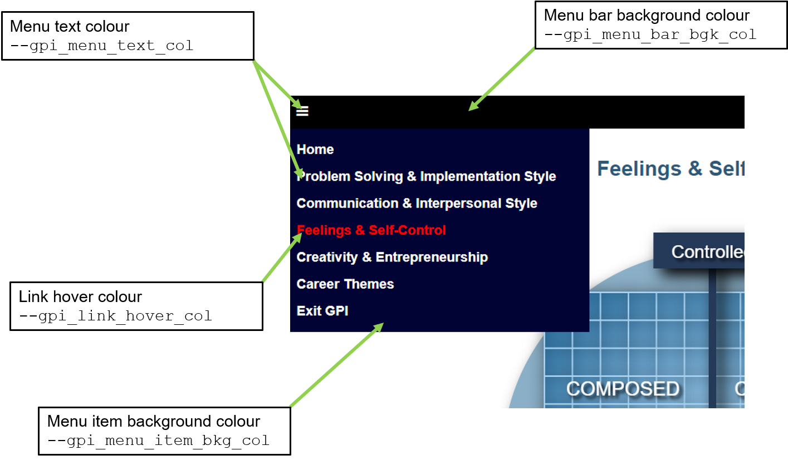
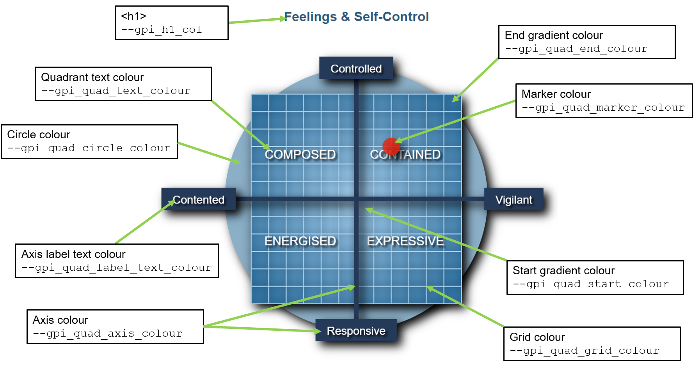
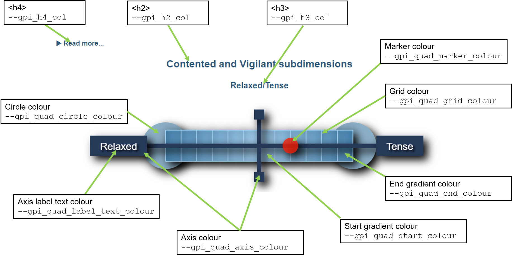

# Edease Test Website

## Contents

+ [Website location](#Website-location) 
+ [CSS formatting of the GPI components](#CSS-formatting-of-the-GPI-components)
   + [CSS variables](#CSS-variables) 
   + [Navigation menu formatting](#Navigation-menu-formatting)
   + [Quadrant visualisation formatting](#Quadrant-visualisation-formatting)
      + [Boolean elements for Quadrants](#Boolean-elements-for-Quadrants)
   + [STEN score formatting](#STEN-score-formatting)
      + [Boolean elements for STEN scores](#Boolean-elements-for-STEN-scores)

## Website location
The website can be found at the following URL:

https://edease.github.io/

## CSS formatting of the GPI components
Formatting of the GPI components should be done entirely via the gpi_edease.css file in the GPI folder. All client-side functionality is provided by GPI.js, which is loaded from the Glowinkowski site. This reads any defined CSS variables in the document object model (DOM) and these are then used in the JavaScript routines to render the GPI component visualisations and GPI-specific formatting.

### CSS variables
The CSS variables are defined under the ```:root``` selector in the CSS file. The table below lists those variables currently defined.

<table>
   <tr><th>CSS variable</th><th>Description</th></tr>
   <tr><td>--gpi_h1_col</td><td>h1 text colour</td></tr>
   <tr><td>--gpi_h2_col</td><td>h2 text colour</td></tr>
   <tr><td>--gpi_h3_col</td><td>h3 text colour</td></tr>
   <tr><td>--gpi_h4_col</td><td>h4 text colour</td></tr>
   <tr><td>--gpi_table_txt_col</td><td>Colour for the GPI survey table</td></tr>
   <tr><td>--gpi_table_bkg_col</td><td>Colour for the GPI survey table background</td></tr>
   <tr><td>--gpi_table_alt_col</td><td>Alternating colour for GPI survey table background</td></tr>
   <tr><td>--gpi_button_bkg_col</td><td>Background colour for GPI buttons</td></tr>
   <tr><td>--gpi_button_txt_col</td><td>Text colour for GPI buttons</td></tr>
   <tr><td>--gpi_quad_circle_colour</td><td>Colour for circle on quadrant / STEN score graphics</td></tr>
   <tr><td>--gpi_quad_show_circle</td><td>If greater than 0, the circle backgrounds are plotted</td></tr>
   <tr><td>--gpi_quad_shadow_on</td><td>If greater than 0, shadows are plotted</td></tr>
   <tr><td>--gpi_quad_start_colour</td><td>Start colour for quadrant / STEN score gradient colour</td></tr>
   <tr><td>--gpi_quad_end_colour</td><td>End colour for quadrant / STEN score gradient colour</td></tr>
   <tr><td>--gpi_quad_axis_colour</td><td>Colour for quadrant / STEN score axes</td></tr>
   <tr><td>--gpi_quad_grid_colour</td><td>Colour for quadrant / STEN score grid</td></tr>
   <tr><td>--gpi_quad_marker_colour</td><td>Colour for quadrant / STEN score location marker</td></tr>
   <tr><td>--gpi_quad_text_colour</td><td>Colour for quadrant text</td></tr>
   <tr><td>--gpi_quad_label_text_colour</td><td>Colour for quadrant / STEN score axis label text</td></tr>
   <tr><td>--gpi_link_col</td><td>Colour for links</td></tr>
   <tr><td>--gpi_menu_bar_bgk_col</td><td>Colour for the navigation menu bar background</td></tr>
   <tr><td>--gpi_menu_text_col</td><td>Colour for the navigation menu bar text</td></tr>
   <tr><td>--gpi_menu_item_bkg_col</td><td>Colour for the navigation menu bar text</td></tr>
   <tr><td>--gpi_link_hover_col</td><td>Colour for the link hover colour</td></tr>
</table>

[Top](#Edease-Test-Website)

### Navigation menu formatting
The formatting root variables for the Quadrant visualisations are indicated in the figure below.

<br><br>



<br><br>

[Top](#Edease-Test-Website)

### Quadrant visualisation formatting
The formatting root variables for the Quadrant visualisations are indicated in the figure below. Note that the both the circle and shadow effects can be optionally omitted.

<br><br>



<br><br>

#### Boolean elements for Quadrants

<table>
   <tr><th>CSS variable</th><th>Description</th></tr>
   <tr><td>--gpi_quad_show_circle</td><td>If greater than 0, the circle backgrounds are plotted. Set to zero to omit circle.</td></tr>
   <tr><td>--gpi_quad_shadow_on</td><td>If greater than 0, shadows are plotted. Set to zero to omit shadow effects.</td></tr>
</table>

[Top](#Edease-Test-Website)

### STEN score formatting
The formatting root variables for the STEN score scales are indicated in the figure below. Note that the both the circle and shadow effects can be optionally omitted.

<br><br>



<br><br>

#### Boolean elements for STEN scores

<table>
   <tr><th>CSS variable</th><th>Description</th></tr>
   <tr><td>--gpi_quad_show_circle</td><td>If greater than 0, the circle backgrounds are plotted. Set to zero to omit circle.</td></tr>
   <tr><td>--gpi_quad_shadow_on</td><td>If greater than 0, shadows are plotted. Set to zero to omit shadow effects.</td></tr>
</table>

[Top](#Edease-Test-Website)

<br><br>


